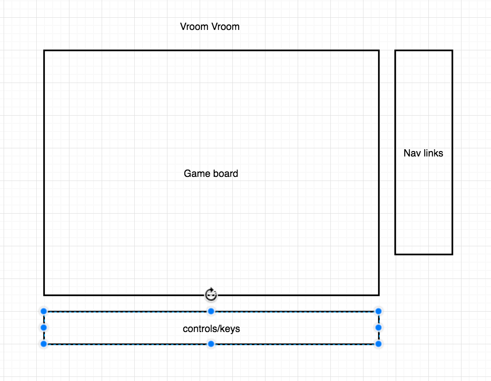

## Rush Hour

### Background

Rush Hour is a interactive browser car game based on the popular board game [Rush Hour][link]
[link]: http://www.thinkfun.com/products/rush-hour/

In Rush Hour, a sliding block logic game, you have to battle the gridlock as you slide the blocking vehicles out of the way for the red car to exit. The points that a player get for each game is calculated based on completness as well as time took to solution.

### Functionality & MVP  

In the Rush Hour game, users will be able to:

- [ ] Start and reset the game board
- [ ] Select car to move with mouse click
- [ ] Move car blocks with the up, down, left and right keys
- [ ] Advance in levels (2 total levels at least)

In addition, this project will include:

- [ ] An About modal/component describing the background and rules of the game
- [ ] A component holding the controls with corresponding keys and what they do
- [ ] A production ReadMe

### Wireframes

This app will consist of a single screen with game board, game controls, and nav links to the Github, my LinkedIn,
and the About modal.  Game controls will include Start and Reset buttons.

### Architecture and Technologies

This project will be implemented with the following technologies:

- Vanilla JavaScript and `jquery` for overall structure and game logic,
- `Easel.js` with `HTML5 Canvas` for DOM manipulation and rendering,
- Webpack to bundle and serve up the various scripts.

In addition to the webpack entry file, there will be three scripts involved in this project:

`board.js`: this script will handle the logic for creating and updating the necessary `Easel.js` elements and rendering them to the DOM.

`car.js`: handle the different types of cars (including length and color) as well as the "target" red car logic.

### Implementation Timeline

**Day 1**: Setup all necessary Node modules, including getting webpack up and running and `Easel.js` installed.  Create `webpack.config.js` as well as `package.json`.  Write a basic entry file and the bare bones of all 3 scripts outlined above.  Learn the basics of `Easel.js`.  Goals for the day:

- Get a green bundle with `webpack`
- Learn enough `Easel.js` to render an object to the `Canvas` element

**Day 2**: Dedicate this day to learning the `Easel.js` API.  First, build out the `Car` object to connect to the `Board` object.  Then, use `board.js` to create and render the game board. Goals for the day:

- Complete the `car.js` module (constructor, update functions)
- Render a game grid to the `Canvas` using `Easel.js`
- add listeners to all the car objects on up down left and right keys (but check this against validMove? method)

**Day 3**: Implement core game logic and built board for 3 (if time, 5) different levels.  Goals for the day:

- Have a functional grid on the `Canvas` frontend that correctly handles iterations from one generation of the game to the next

**Day 4**: Install the controls for the user to interact with the game.  Style the frontend, making it polished and professional.  Goals for the day:

- Create controls for stop, start, reset
- Have a styled `Canvas`, nice looking controls and title

### Bonus features

Some anticipated updates are:

- [ ] Adding hints in a modal on the side
- [ ] Add scoreboard and scoring mechanisms to take into account the time it took a user to finish a game
- [ ] More levels and better graphics
